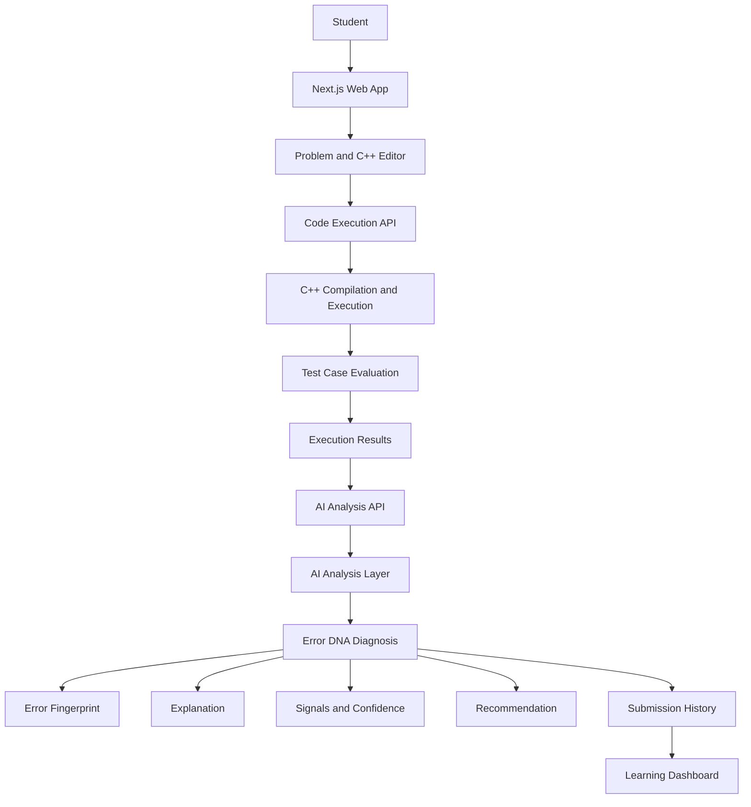
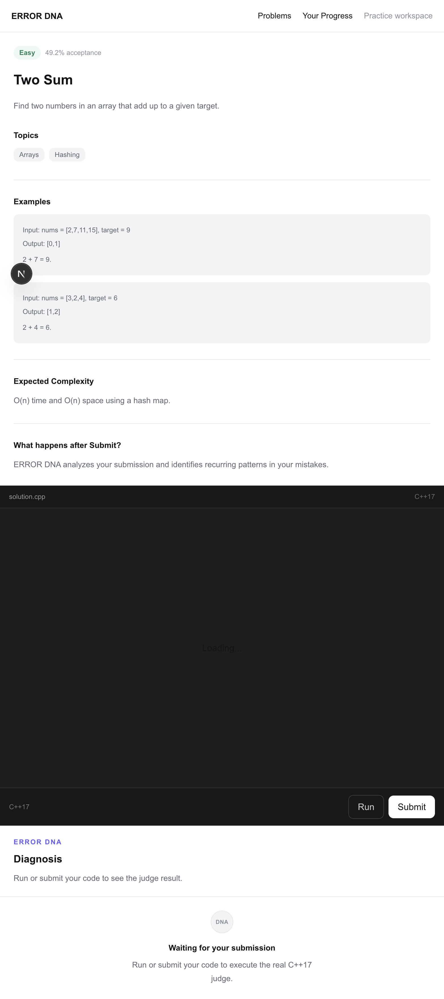
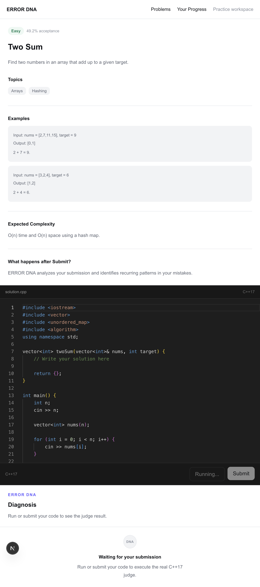
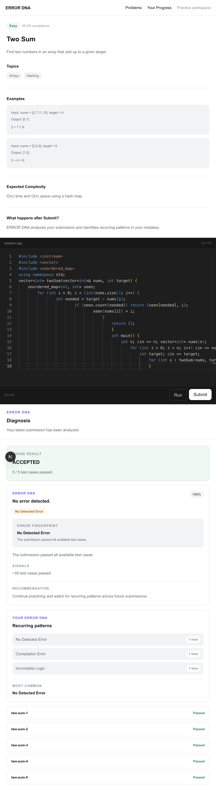
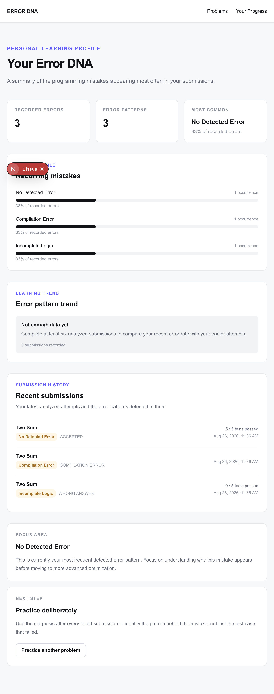
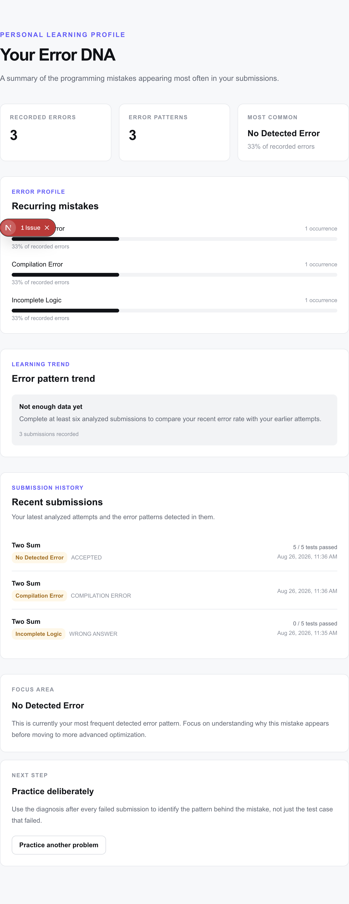

# ERROR DNA

> Don't just fix the code. Understand the mistake.

**Live demo:** [error-dna-15-eu0r49bie-sahith6.vercel.app](https://error-dna-15-eu0r49bie-sahith6.vercel.app/)

ERROR DNA is a coding practice platform for students who need more than a binary judge result. A normal `Wrong Answer` tells a student that the output is incorrect, but not what reasoning pattern may have caused the mistake. ERROR DNA runs C++ submissions against multiple test cases, examines the execution evidence, and turns the result into an understandable diagnosis that students can use to improve.

## Why It Matters

Repeatedly guessing at changes until a solution is accepted can hide the underlying misconception. ERROR DNA connects each submission to an error category and fingerprint, then provides an explanation, supporting signals, confidence, and a concrete recommendation. Over time, the dashboard makes recurring patterns visible.

## Features

- C++ coding problems with difficulty filtering and search
- Monaco-based C++17 editor
- Multi-test-case compilation and execution
- Accepted, Wrong Answer, Compilation Error, Runtime Error, and Time Limit Exceeded results
- Test-case expected and actual output comparison
- Error categories and fingerprints such as Logic Error, Incomplete Logic, Edge Case Handling, Complexity, and Runtime Crash
- Diagnosis explanations, confidence scores, signals, and recommendations
- Local submission history
- Error profile with recurring patterns and most-common errors
- Learning trend comparing recent and earlier submission error rates

## AI Analysis Layer

The current repository does not contain a trained machine-learning model or an external AI provider integration. Its analysis layer is a deterministic TypeScript analyzer in `/api/analyze` that applies diagnosis rules to the available submission evidence.

The UI sends the analyzer:

- Submitted C++ source code
- Judge status from `/api/execute`
- Compiler or runtime error text when available
- Each test case's pass/fail state, expected output, and actual output

The analyzer returns a diagnosis containing:

- Error category and title
- Confidence score
- Explanation
- Evidence signals
- Recommendation
- Stable error fingerprint ID, name, and description

This design provides an explainable analysis foundation for the current demo. A trained model or external AI service is future work, not a claim about the current implementation.

## Judge Verification - Correct Solutions

The following solutions are the intended correct C++17 solutions for the 8 problems included in ERROR DNA.

### How to verify

1. Open the corresponding problem on the [deployed application](https://error-dna-15-eu0r49bie-sahith6.vercel.app/).
2. Copy the complete solution into the editor.
3. Run or submit it.
4. The expected result is `ACCEPTED`.

> Note: These solutions are provided so judges can independently verify the problem implementations even if the hosted execution environment is unavailable.

### Problem 1 - Two Sum

```cpp
#include <iostream>
#include <vector>
#include <unordered_map>
using namespace std;

vector<int> twoSum(vector<int>& nums, int target) {
      unordered_map<int, int> seen;

      for (int i = 0; i < nums.size(); i++) {
            int complement = target - nums[i];
            if (seen.count(complement)) return {seen[complement], i};
            seen[nums[i]] = i;
      }

      return {};
}

int main() {
      int n;
      cin >> n;
      vector<int> nums(n);
      for (int i = 0; i < n; i++) cin >> nums[i];
      int target;
      cin >> target;

      for (int index : twoSum(nums, target)) cout << index << " ";
      return 0;
}
```

### Problem 2 - Valid Parentheses

```cpp
#include <iostream>
#include <string>
#include <stack>
#include <unordered_map>
using namespace std;

bool isValid(string s) {
      stack<char> brackets;
      unordered_map<char, char> matching = {{')', '('}, {']', '['}, {'}', '{'}};

      for (char current : s) {
            if (current == '(' || current == '[' || current == '{') {
                  brackets.push(current);
            } else if (brackets.empty() || brackets.top() != matching[current]) {
                  return false;
            } else {
                  brackets.pop();
            }
      }

      return brackets.empty();
}

int main() {
      string s;
      getline(cin, s);
      cout << (isValid(s) ? "true" : "false");
      return 0;
}
```

### Problem 3 - Binary Search

```cpp
#include <iostream>
#include <vector>
using namespace std;

int search(vector<int>& nums, int target) {
      int left = 0;
      int right = nums.size() - 1;

      while (left <= right) {
            int middle = left + (right - left) / 2;
            if (nums[middle] == target) return middle;
            if (nums[middle] < target) left = middle + 1;
            else right = middle - 1;
      }

      return -1;
}

int main() {
      int n;
      cin >> n;
      vector<int> nums(n);
      for (int i = 0; i < n; i++) cin >> nums[i];
      int target;
      cin >> target;
      cout << search(nums, target);
      return 0;
}
```

### Problem 4 - Best Time to Buy and Sell Stock

```cpp
#include <iostream>
#include <vector>
#include <algorithm>
using namespace std;

int maxProfit(vector<int>& prices) {
      if (prices.empty()) return 0;

      int minimumPrice = prices[0];
      int maximumProfit = 0;

      for (int price : prices) {
            minimumPrice = min(minimumPrice, price);
            maximumProfit = max(maximumProfit, price - minimumPrice);
      }

      return maximumProfit;
}

int main() {
      int n;
      cin >> n;
      vector<int> prices(n);
      for (int i = 0; i < n; i++) cin >> prices[i];
      cout << maxProfit(prices);
      return 0;
}
```

### Problem 5 - Valid Anagram

```cpp
#include <iostream>
#include <string>
#include <unordered_map>
using namespace std;

bool isAnagram(string s, string t) {
      if (s.size() != t.size()) return false;

      unordered_map<char, int> counts;
      for (char character : s) counts[character]++;

      for (char character : t) {
            if (--counts[character] < 0) return false;
      }

      return true;
}

int main() {
      string s;
      string t;
      getline(cin, s);
      getline(cin, t);
      cout << (isAnagram(s, t) ? "true" : "false");
      return 0;
}
```

### Problem 6 - Longest Substring Without Repeating Characters

```cpp
#include <iostream>
#include <string>
#include <unordered_map>
#include <algorithm>
using namespace std;

int lengthOfLongestSubstring(string s) {
      unordered_map<char, int> lastSeen;
      int left = 0;
      int longest = 0;

      for (int right = 0; right < s.size(); right++) {
            char character = s[right];
            if (lastSeen.count(character) && lastSeen[character] >= left) {
                  left = lastSeen[character] + 1;
            }
            lastSeen[character] = right;
            longest = max(longest, right - left + 1);
      }

      return longest;
}

int main() {
      string s;
      getline(cin, s);
      cout << lengthOfLongestSubstring(s);
      return 0;
}
```

### Problem 7 - Search in Rotated Sorted Array

```cpp
#include <iostream>
#include <vector>
using namespace std;

int search(vector<int>& nums, int target) {
      int left = 0;
      int right = nums.size() - 1;

      while (left <= right) {
            int middle = left + (right - left) / 2;
            if (nums[middle] == target) return middle;

            if (nums[left] <= nums[middle]) {
                  if (nums[left] <= target && target < nums[middle]) right = middle - 1;
                  else left = middle + 1;
            } else {
                  if (nums[middle] < target && target <= nums[right]) left = middle + 1;
                  else right = middle - 1;
            }
      }

      return -1;
}

int main() {
      int n;
      cin >> n;
      vector<int> nums(n);
      for (int i = 0; i < n; i++) cin >> nums[i];
      int target;
      cin >> target;
      cout << search(nums, target);
      return 0;
}
```

### Problem 8 - Subarray Sum Equals K

```cpp
#include <iostream>
#include <vector>
#include <unordered_map>
using namespace std;

int subarraySum(vector<int>& nums, int k) {
      unordered_map<int, int> prefixCounts;
      prefixCounts[0] = 1;

      int prefixSum = 0;
      int result = 0;

      for (int value : nums) {
            prefixSum += value;
            result += prefixCounts[prefixSum - k];
            prefixCounts[prefixSum]++;
      }

      return result;
}

int main() {
      int n;
      cin >> n;
      vector<int> nums(n);
      for (int i = 0; i < n; i++) cin >> nums[i];
      int k;
      cin >> k;
      cout << subarraySum(nums, k);
      return 0;
}
```

## Architecture



## Example Workflow

```text
Wrong Submission
      ↓
Test Cases
      ↓
Execution Evidence
      ↓
AI Analysis Layer
      ↓
Error DNA Diagnosis
      ↓
Explanation + Recommendation
      ↓
Student Fixes Code
      ↓
Accepted
      ↓
Submission History
```

## Screenshots

The screenshots below show the implemented problem-solving and progress flows.











## Repository Structure

```text
error-dna/
├── app/
│   ├── api/
│   │   ├── analyze/route.ts      # Deterministic diagnosis endpoint
│   │   └── execute/route.ts      # C++17 compile, run, and judge endpoint
│   ├── dashboard/page.tsx        # Error profile, trends, and history
│   ├── problems/[id]/page.tsx    # Problem workspace and submission flow
│   ├── page.tsx                  # Problem library and filters
│   ├── globals.css               # Application theme and styles
│   └── layout.tsx                # Root layout and metadata
├── components/
│   ├── coding-workspace/CodeEditor.tsx
│   └── problem-bank/ProblemCard.tsx
├── data/problems.ts              # Problem definitions and test cases
├── public/                       # Static assets
├── screenshots/                  # README screenshots
├── package.json
├── next.config.ts
├── postcss.config.mjs
├── eslint.config.mjs
└── README.md
```

## Tech Stack

| Technology | Use in this project |
| --- | --- |
| Next.js 16 | App Router UI and API routes |
| React 19 | Interactive problem workspace and dashboard |
| TypeScript | Application, route, and data types |
| Tailwind CSS 4 | Styling through the Tailwind PostCSS plugin |
| Monaco Editor | C++ code editing experience |
| Hosted C++17 compiler APIs | Server-side compilation and submission execution |
| TypeScript analysis layer | Deterministic diagnosis in `/api/analyze` |
| Browser `localStorage` | Submission history and Error DNA aggregation |

## Getting Started

Prerequisites: Node.js and npm. C++ submissions use hosted compiler APIs from the server-side execution route.

```bash
npm install
npm run dev
```

Open [http://localhost:3000](http://localhost:3000) to use the platform.

Validation commands:

```bash
npm run lint
npm run build
```

No environment variables are required by the current repository configuration.

## Educational Impact

ERROR DNA helps students study the cause behind an incorrect submission instead of repeatedly changing code until it passes. The combination of execution evidence, explainable signals, recommendations, and recurring fingerprints supports deliberate practice and reflection.

## Hackathon Relevance

- **Educational Impact:** Converts opaque judge outcomes into actionable learning feedback.
- **Creative Use of AI/ML:** Uses an explainable analysis layer to organize code and execution evidence into error diagnoses; the current implementation does not claim a trained model.
- **Technical Execution:** Connects a Next.js editor, API routes, local C++17 compilation, isolated temporary execution, multi-case evaluation, diagnosis, and browser-persisted progress.
- **Pitch/Demo:** The value is easy to show in one short loop: submit, understand the mistake, fix it, and see progress accumulate.

## Demo

The 2-minute demo shows:

```text
Wrong submission → AI diagnosis → correction → Accepted → Dashboard
```

## Future Work

- Replace or extend the deterministic analyzer with a trained or externally hosted model.
- Add authenticated, server-side student profiles and synced history.
- Expand the problem library and diagnosis patterns.
- Add richer longitudinal learning analytics.

## Closing Thought

> Traditional coding platforms judge the answer. ERROR DNA understands the mistake.
